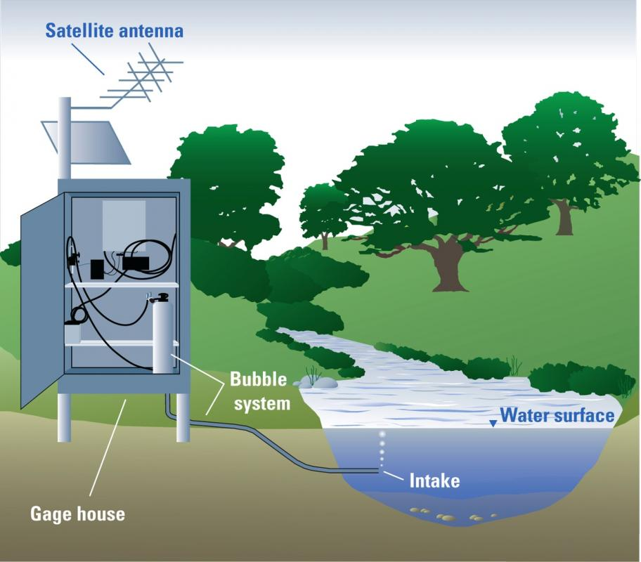

# Streamflow Monitor

## Overview

**Streamflow Monitor** is a web application designed for the monitoring and
visualization of streamflow data across various gauge stations within the United
States, with a specific focus on the state of Missouri. The application displays
data from 274 gauge stations, providing insights into the streamflow and gauge
height measurements.

Streamflow, defined as the volume of water flowing through a given section of a
stream per unit time, along with gauge height, which is the height of water at a
particular point, are critical parameters for water resource management. These
measurements are essential for determining water availability, monitoring
watershed health, and predicting flood risks.

The United States Geological Survey (USGS) operates numerous stream gauges
across the country, collecting data on these parameters. The **Streamflow
Monitor** web app accesses this valuable data using the USGS Water Services API.

  
_Figure: Diagram of streamgage that uses pressured gas to measure the stage of
the stream. (Courtesy of USGS)_

## Importance of Streamflow Measurements

Measurements of streamflow are crucial for:

- **Water Resource Management**: Understanding the availability and distribution
  of water resources in a given area.
- **Flood Predictions**: Providing data necessary for forecasting flood events
  and preparing mitigation strategies.
- **Environmental Protection**: Monitoring the health of ecosystems that depend
  on streamflow patterns.

## Features

- **Data Visualization**: Interactive maps and graphs that display real-time
  streamflow and gauge height data.
- **Gauge Station Selection**: Users can select specific gauge stations to view
  detailed data and historical trends.
- **Responsive Design**: Optimized for both desktop and mobile devices, ensuring
  access to data anytime, anywhere.

## Data Source

The application utilizes data from the USGS Water Services API, which offers
comprehensive and up-to-date information on streamflow conditions across the
United States.

For more details on how stream gauges work and their importance, visit
[this informative blog post by the Ausable River Association](https://www.ausableriver.org/blog/how-do-streamgages-work).

## Getting Started

To use the Streamflow Monitor web app, simply navigate to the application URL
(link to be provided) on any web browser. Select a state or specific gauge
station to begin exploring streamflow data.

## Contributions

Contributions to the Streamflow Monitor project are welcome. If you have ideas
for improvements or have found a bug, please open an issue or submit a pull
request.

## License

This project is licensed under the MIT License - see the [LICENSE](LICENSE) file
for details.
